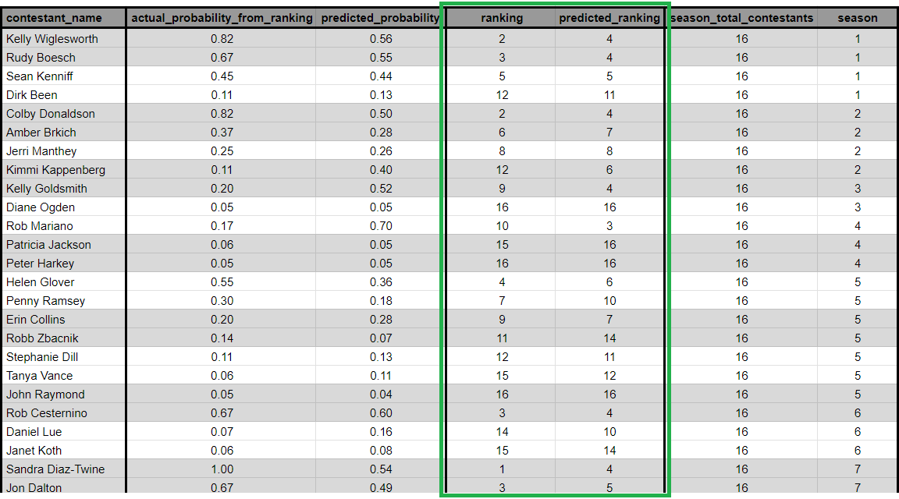

# Survivor Winner Predictor
Uses machine learning to predict the winner of the reality competition TV show, Survivor.

## Key Components:
- **Data Collection/Storage** (Python: pandas, Beautiful Soup, psycopg2. Databases: PostgreSQL, pgAdmin)
  - Mass web scraping/parsing of the Survivor Wiki for data on ~700 contestants across 45 seasons
  - Supplemented with immunity idols and contestant confessionals data
  - Note to self: Probably need to go back and remove med-evacs (or handle them some other way).

- **Feature Engineering** (Python: pandas, OpenAI API, scikit-learn)
  - Automated LLM-analysis of players' Wiki descriptions/summaries (for each individual season) into social and strategy scores (b/w 1-10) using OpenAI API
    - Social Score Criteria - The social score evaluates a contestant's interpersonal skills, likability, and ability to navigate and influence social dynamics.
      1) Alliance Formation and Maintenance: The ability to create and maintain alliances that further the contestant's game.
      2) Social Integration: Effectiveness in becoming a key member of the group, avoiding social isolation.
      3) Jury Management: Skill in managing relationships with eventual jury members, crucial for securing votes in the final.
      4) Conflict Resolution: Competence in resolving disputes in a way that does not jeopardize their standing in the game.
    - Strategy Score Criteria - The strategy score assesses the contestant's game planning, tactical moves, and adaptability to changing dynamics.
      1) Strategic Planning: The ability to devise and implement plans that enhance their position in the game.
      2) Adaptability: Quick adjustment to new developments and ability to pivot strategies as the game evolves.
      3) Game-Changing Moves: Successfully executing moves that significantly alter the course of the game, including
         blindsides and effective use of immunity idols.

  - Continuous Probability Transformation of "Ranking" feature:
    - Chose a non-linear, exponential decay probability transformation function. One concern/challenge with this problem space is that once the tribe merge occurs in Survivor, it often becomes beneficial for strong players to try to keep bad players around until the end, with the hope that at the Final Trible Council, the strong player will be the clear winner pick amongst Jury Members; in other, simpler words (for anyone who doesn't watch the show), a strong player in power eventually wants to eliminate other threat competitors over less-threatening competitors. This phenomenon is challenging to incorporate into a machine learning model. However, by choosing a non-linear probability transformation function, more "weight" is added to winning players.
      
      
      
    - Also considered a linear probability transformation function.
      
      
      
    - Initial expontential decay α-value of 0.2 was chosen as ideal for this problem space:
      
      
      
    - The expontential decay α-value and choice of probability transformation function are hyperparemeters that will likely be explored further during Model Iteration/Refinement phase.
  - Normalized data as needed across historical seasons, as predictions for current season will be made week-to-week:
    - Ex #1: num_confessionals -> confessionals_per_epi. Chose to amortize this feature across number of episodes, as this feature is more of a representation of the storylines the producers want to tell, which is episode-to-episode.
    - Ex #2: challenge_wins -> challenge_wins_per_day_lasted. Chose to amortize this feature across number of days lasted, as this feature is more objective in regard to challenge success. More specifically, days_lasted and the combined challenge_wins_per_day_lasted columns are actually the number of days a contestant was eligible for challenges, which was a feature engineering decision to account for seasons which have twists like Edge of Extinction.

- **ML model training** (Python: scitkit-learn)
  - Started with a Linear Regression model as a baseline (model v1); Random Forest Regression was used for model v2, with improvements on all metrics (MSE, MAE, R^2).
  - Model creation file (src/models/ml_modeling.py) was created to easily and modularly allow for new models to be generated.
  - Data was split 60%/20%/20% train/validation/test.
  - Considered splitting data based on seasons and ensuring each data partition contained representation from early, mid and late seasons of the game (because as the game's dynamics, and therefore also the impact of my selected features, have shifted over time). However, using the linear probability transformation function described in the Feature Engineering section mitigates this issue, while also allowing for better generalization without getting fixed on season-specific nuances.
  - Model predictions using v2 (all predictions can be seen in src/models/trained/v2_random_forest/predictions.csv):

    

  - v2 Random Forest model performed better than v1 model in MSE, MAE, and R^2:

    

- **ML model predictions**
  - 3/19/2024 update - Currently entering this stage!
  - Will be applied to current/ongoing season (currently S46) on a weekly basis based on updated data, with week-to-week contestant placement predictions being tracked in a table.
  - Will manual enter S46 data for the first 1-2 weeks of predictions, then will switch to an automated approach shortly afterward.
  - Automated approach will leverage LLM-analysis using OpenAI API, similar to how historical contestant descriptions were processed. May use episode transcripts and/or web scraped data from the Survivor subreddit.
  - Once a season concludes, the data will be used for the next training iteration of the ML model, then be applied to the next season week-to-week.

- **Model Iteration/Refinement**
  - Areas to explore in future model iterations:
    - Will at some point refine the "num_idols_possessed" feature, as well as potentially add/refine any other features.
    - v2 Random Forest model feature importances were:
      - num_idols_possessed: 0.077
      - social_score: 0.090
      - strategy_score: 0.239
      - challenge_wins_per_day_lasted: 0.285
      - confessionals_per_epi: 0.308
    - Random Forest hyperparameter tuning
    - Changing α-value for probability transformation function (or even exploring different functions).
    - K-fold Cross-Validation. ML model creation file was built with K-fold CV already implemented, but executed with K=1 (i.e., no K-fold CV) for v1 and v2 models to establish simple baselines.

## Tools:
- Python
  - scikit-learn
  - pandas
  - Beautiful Soup / requests
  - psycopg2
  - openai (LLM API)
- Databases
  - PostgreSQL
  - pgAdmin
 
# More coming soon...
